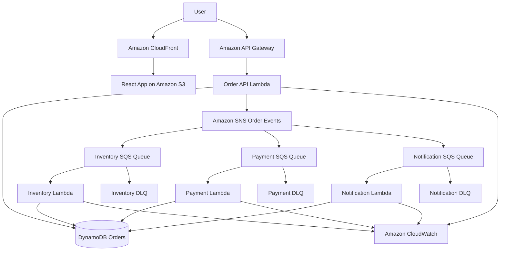

# EventFlow — Event-Driven Order Processing System

# EventFlow — Event-Driven Order Processing System

## 🚀 Live Demo

https://d2np3ip95xp6x3.cloudfront.net/

EventFlow is a production-style React frontend that demonstrates how a serverless AWS order platform accepts work synchronously and processes it asynchronously. It is designed as an AWS Solutions Architect portfolio project: the interface makes SNS fan-out, SQS buffering, independent Lambda consumers, retries, dead-letter queues, eventual consistency, and CloudWatch observability visible and easy to discuss.

> Frontend only: this repository does not create AWS resources, invoke a real payment provider, or require authentication.

## Business problem

Order workflows often become fragile when inventory, payment, and notification are executed in a single synchronous request. A slow dependency increases customer latency; a failure can cascade; and traffic bursts can overwhelm downstream services. EventFlow demonstrates a decoupled alternative in which the API stores the order, publishes one domain event, and returns quickly while independent consumers continue processing.

## Architecture summary



The future backend will use API Gateway, Lambda, DynamoDB, SNS, SQS, and CloudWatch. S3 and CloudFront are planned for static frontend hosting. See [docs/architecture.md](docs/architecture.md) for boundaries, failure modes, and data flow.

## Frontend technology stack

- React 19, Vite, and strict TypeScript
- React Router for seven portfolio routes
- Tailwind CSS plus a reusable application design system
- Lucide React icons and Recharts dashboards
- Native Fetch API with typed errors and AbortController support
- Vitest and React Testing Library
- ESLint and Prettier

## Features

- Executive dashboard with order volume, outcomes, processor health, recent orders, recent events, and operational alerts
- Validated order-entry workflow with eight products, tokenised payment simulations, confirmation dialog, loading/error states, toasts, and GBP totals
- Searchable, filterable, sortable, paginated orders view with responsive mobile cards
- Detailed workflow, processor result cards, order data, expandable event timeline, JSON copy action, cancellation, and event simulation
- Live-style event monitor with pause/resume, auto-refresh, filters, correlation IDs, service-flow animation, and payload drawer
- Frontend-rendered AWS architecture diagram, service responsibilities, and architecture decision records
- System-health dashboard with service states, six queues, CloudWatch-style charts, and alarms
- Frontend-only processing engine with success, inventory, payment, retry, notification, DLQ, and partial-failure scenarios
- Twelve realistic seed orders and localStorage persistence
- Practical keyboard, screen-reader, reduced-motion, focus, mobile, tablet, and desktop support

## Screenshots

Add final portfolio captures to `docs/screenshots/`:

- `dashboard.png` — desktop operations overview
- `order-details.png` — workflow and event timeline
- `architecture.png` — AWS architecture diagram
- `mobile-orders.png` — responsive order cards

## Local setup

Requirements: Node.js 20.19+ and npm.

```bash
npm install
cp .env.example .env.local
npm run dev
```

Vite prints the local address. No AWS account or credentials are needed in mock mode.

## Environment variables

```dotenv
VITE_API_BASE_URL=
VITE_USE_MOCK_API=true
VITE_ENABLE_EVENT_SIMULATION=true
```

- Keep `VITE_API_BASE_URL` empty until a backend exists. Never commit a real environment URL.
- `VITE_USE_MOCK_API=true` selects the local repository and seed data.
- `VITE_ENABLE_EVENT_SIMULATION=true` advances new orders automatically after submission.

## Mock mode

Mock mode is a deterministic frontend contract, not a security boundary. Orders and their generated event history are stored under a versioned localStorage key. The order form can choose success, insufficient inventory, declined payment, payment timeout/retry, notification retry, inventory failure, DLQ, or partial failure. Refreshing the browser preserves state on that device. Clear site data to restore the twelve seeded orders.

## API contract

The service layer switches to native `fetch` when mock mode is disabled and a base URL is present. Planned endpoints:

| Method | Path                       | Responsibility                |
| ------ | -------------------------- | ----------------------------- |
| POST   | `/orders`                  | Validate and accept an order  |
| GET    | `/orders`                  | Query paginated orders        |
| GET    | `/orders/{orderId}`        | Fetch the current aggregate   |
| GET    | `/orders/{orderId}/events` | Fetch the event timeline      |
| POST   | `/orders/{orderId}/cancel` | Request cancellation          |
| POST   | `/orders/{orderId}/retry`  | Retry an eligible processor   |
| GET    | `/events`                  | Query operational events      |
| GET    | `/health`                  | Read system health            |
| GET    | `/metrics`                 | Read operational metrics      |
| GET    | `/alerts`                  | Read active and recent alarms |

The client rejects non-2xx responses with a typed `ApiError` and exposes safe messages without stack traces. Full request and response examples live in [docs/api-contract.md](docs/api-contract.md).

## Folder structure

```text
src/
├── components/       Reusable common, event, layout, and order UI
├── data/             Product and payment reference data
├── hooks/            Application state and mock orchestration
├── mocks/            Scenario engine and seed records
├── pages/            Route-level views
├── services/         Mock/HTTP API boundary
├── test/             Unit and component tests
├── types/            Domain interfaces and API errors
├── utils/            Formatting, totals, validation, and status rules
├── App.tsx            Route composition
└── main.tsx           Application bootstrap
docs/                  Architecture, API, and interview guides
```

## Quality checks

```bash
npm run lint
npm test
npm run build
npm run format:check
```

Tests cover currency and status formatting, order totals, form validation, overall-state derivation, successful and declined-payment processing, the workflow, and the timeline.

## Deploying the frontend to Amazon S3 and CloudFront

Build the standalone static bundle:

```bash
npm run build
```

The deployable frontend is generated entirely in `dist/`. Upload it to a private S3 bucket and place CloudFront in front of the bucket using Origin Access Control. A typical deployment command is:

```bash
aws s3 sync dist/ s3://YOUR_BUCKET_NAME/ --delete
aws cloudfront create-invalidation --distribution-id YOUR_DISTRIBUTION_ID --paths "/*"
```

Because EventFlow uses client-side routing, configure CloudFront custom error responses so S3 `403` and `404` responses return `/index.html` with HTTP status `200`. Set long-lived immutable caching on hashed files under `dist/assets/`, but use a short cache lifetime for `index.html`. Configure `VITE_API_BASE_URL` before the build when the AWS API is available.

## Backend deployment roadmap

1. Define DynamoDB keys and conditional-write patterns.
2. Implement the API Lambda with schema validation, idempotency, and structured logging.
3. Publish `ORDER_CREATED` to SNS after the durable write.
4. Subscribe processor queues and configure visibility timeout, redrive, and concurrency limits.
5. Implement idempotent inventory, payment-simulation, and notification Lambdas.
6. Expose read models, metrics, health, alerts, and least-privilege API access.
7. Add CI, infrastructure as code, automated integration tests, and S3/CloudFront delivery.

## Security considerations

The production design should add Cognito or another OIDC provider, API Gateway authorisers, TLS-only endpoints, AWS WAF, request-schema validation, input-size limits, least-privilege IAM, KMS encryption, Secrets Manager, DynamoDB encryption, CloudTrail, log redaction, dependency scanning, CSP/security headers, and protected deployment pipelines. Payment remains simulated so PCI scope is intentionally avoided.

## Reliability considerations

SQS provides buffering and at-least-once delivery, so consumers must be idempotent. Use conditional writes for processor state, message-grouping only when ordering is required, timeouts below queue visibility timeout, exponential backoff with jitter, bounded receives, DLQ alarms, controlled replay, Lambda concurrency caps, correlation IDs, and CloudWatch SLOs. The frontend communicates eventual consistency rather than pretending all results are immediate.

## Cost considerations

The architecture scales to zero for idle Lambda workloads and uses pay-per-request managed services. Costs primarily follow API calls, Lambda duration, DynamoDB capacity/storage, SNS/SQS requests, CloudWatch ingestion/retention, and CloudFront egress. Sampling traces, setting log retention, right-sizing memory, batching SQS records, and adding AWS Budgets reduce operational spend.

## Interview talking points

- Separate the synchronous acceptance path from asynchronous business processing.
- Explain why SNS plus three SQS queues is more resilient than three direct Lambda invokes.
- Describe at-least-once delivery, idempotency, visibility timeouts, retries, and DLQs.
- Discuss eventual consistency as a product experience as well as a backend property.
- Trace a single correlation ID across API Gateway, Lambda, SNS, SQS, DynamoDB, and CloudWatch.
- Explain how per-consumer concurrency limits protect downstream inventory, payment, and notification dependencies.

See [docs/interview-guide.md](docs/interview-guide.md) for a complete walkthrough.

## Future enhancements

- AWS CDK or Terraform deployment
- Cognito authentication and role-aware operations
- Server-Sent Events or WebSockets for live status updates
- X-Ray/OpenTelemetry traces and deep-linked CloudWatch logs
- DLQ replay tooling and alarm acknowledgement
- DynamoDB Streams read models and analytics export
- Contract, load, resilience, and accessibility test suites

## Contributing and licence

See [CONTRIBUTING.md](CONTRIBUTING.md). The licence file is a portfolio placeholder and should be replaced with the owner’s chosen licence before public reuse.
